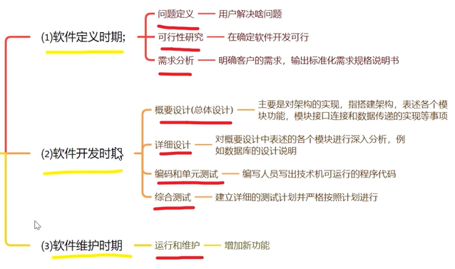

# LearningTasks

## 学习任务

### C++
1. 项目 1
   1. 项目 A
   2. 项目 B
2. 项目 2
   1. 项目 A
   2. 项目 B 

  

### 数据结构
1. 项目 1
   1. 项目 A
   2. 项目 B
2. 项目 2
   1. 项目 A
   2. 项目 B

### 软件工程

1. 第一章  

     
   
   1. 什么是软件？  
   答：软件是计算机系统中与硬目互依存的另一部分，它包括程序、数据及其文档的完整集合。
   数据：是使程序能够适当处理信息的数据结构。  
   程序：是能够完成顺定功能和性能的可执行指令序列。  
   文档：是开发、使用和维护过程程序所需要的图文资料。  
   计算机科学对软件的定义是，“软件是在计算机系统支持下，能够完成特定功能和性能的程
序、数据和相关的文档"。  
   (软件是指指令和数据的集合)
   
   2. 软件危机  
      
      1. 概念  
      在计算机软件开发和维护过程中所遇到的一系列严重问题  
      
      2. 包含两方面内容：  
      1、如何开发软件，以满足对软件日益增长的需求  
      2、如何维护数量不断膨胀的已有软件  
      
      3. 具体表现：  
      对软件开发成本和进度估算不准确用户对已完成软件不满意  
      软件质量不可靠  
      没有适当文档资料  
      软件不可维护  
      软件成本在计算机系统中所占比例逐年上升  
      软件开发生产率低  
   
   3. 软件工程  
      
      1. 定义  
      采用工程的概念、原理、技术和方法来开发维护软件，把经过时间考验而证明正确的管理技术和当前能够得到的最好的技术方法结合起来，经济的开发出高质量的软件并维护它。  
      
      2. 三个要素  
      方法、工具和过程    
   
   4. 软件生存周期  
   软件开始研制到最终软件废弃不用所经历的各个阶段。  
   3时期，8阶段  
   
   
   5. 软件过程模型  
   是为了获得高质量软件所需要完成的一系列任务框架。通常用软件生命周期模型描述软件过程。  
   主要包括：  
   瀑布模型 增量模型 螺旋模型 喷泉模型和其他模型  
      
      1. 瀑布模型  
      是将软件生存周期中的各个活动规定为依线鬱匝序连接的若干阶段的模型包括需求分析、设计、编码、测试、运行与维护。它规定了由前至后、相互衔接的固定次序，如同瀑布流水逐级下落，  
        
      瀑布模型的优点．有利于大型软件开发过程中人员的组织、管理，有利于软件开发方法和工具的研究，从而提高了大型软件项目开发的质量和效率。  
      瀑布模型的缺点：  
      （1）开发过程一般不能逆转，否则代价太大；  
      （2）实际的项目开发很难严格按该模型进行；  
      
      2. 增量模型  
      融合了瀑布模型的基本成分和原型实现的迭代特征，它假设可以将需求分段为一系列增量产品，每一增量可以分别开发。   
        
      增量模型的优点：  
      （1）采用增量模型的优点是人员分配灵活，刚开始不用投入大量人力资源；  
      （2）如果核心产品很受欢迎，则可增加人力实现下一个增量；  
      （3）可先发布部分功能给客户，对客户起到镇静剂的作用.  
      增量模型的缺点：  
      （1）并行开发构件有可能遇到不能集成的风险，软件必须具备开放式的体系结构  

      3. 螺旋模型  
      最主要的特点在于加入了风险分析。它是山制定计划、风险分析、实施工程、客户评估这一循环组成的，它最初从概念项目开始第一个螺旋。属于面向对象开发模型，强调风险引入。  
      螺旋模型将开发过程分为几个螺旋周期，每个螺旋周期大致和瀑布模型相符合  
      每个螺旋周期分为如下4个工作步骤。  
      （1）制订计划。确定软件的目标，选定实施方案，明确项目开发的限制条件。  
      （2）风险分析。分析所选的方案，识别风险，消除风险。  
      （3）实施工程。实施软件开发，验证阶段性产品。  
      （4）用户评估。评价开发工作，提出修正建议，建立下一个周期的开发计划。  
        
      螺旋模型的优点：  
      （1）十上的灵活性，可以在项目的各个阶段进行变更；  
      （2）以小的分段来构建大型系统，使成本计算变得简单容易；  
      螺旋模型的缺点：过多的迭代次数会增加开发成本，延迟提交时间。  

      4. 喷泉模型  
      会将软件开发划分为多个阶段，但各个阶段无明显界限，并且可以迭代交叉  
      喷泉模型是一种以用户需求为动力，以对象作为驱动的模型，适合于面向对象的开发方法。在设计活动结束后才开始编码活动，而是允许各开发活动交叉、迭代地进行。  
        

2. 第二章  

### 离散数学
1. 项目 1
   1. 项目 A
   2. 项目 B
2. 项目 2
   1. 项目 A
   2. 项目 B