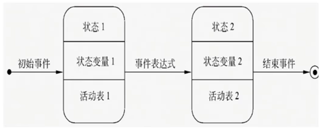

# LearningTasks

## 学习任务

### C++
1. 项目 1
   1. 项目 A
   2. 项目 B
2. 项目 2
   1. 项目 A
   2. 项目 B 

  

### 数据结构
1. 项目 1
   1. 项目 A
   2. 项目 B
2. 项目 2
   1. 项目 A
   2. 项目 B

### 软件工程

第一章：概述  

     
   
   1. 什么是软件？  
      答：软件是计算机系统中与硬目互依存的另一部分，它包括程序、数据及其文档的完整集合。  
      数据：是使程序能够适当处理信息的数据结构。  
      程序：是能够完成顺定功能和性能的可执行指令序列。  
      文档：是开发、使用和维护过程程序所需要的图文资料。  
      
      计算机科学对软件的定义是，“软件是在计算机系统支持下，能够完成特定功能和性能的程序、数据和相关的文档"。  
      (软件是指指令和数据的集合)
   
   2. 软件危机  
      
      1. 概念  
         在计算机软件开发和维护过程中所遇到的一系列严重问题  
      
      2. 包含两方面内容：  
         1、如何开发软件，以满足对软件日益增长的需求  
         2、如何维护数量不断膨胀的已有软件  
      
      3. 具体表现：  
         对软件开发成本和进度估算不准确用户对已完成软件不满意  
         软件质量不可靠  
         没有适当文档资料  
         软件不可维护  
         软件成本在计算机系统中所占比例逐年上升  
         软件开发生产率低  
   
   3. 软件工程  
      
      1. 定义  
         采用工程的概念、原理、技术和方法来开发维护软件，把经过时间考验而证明正确的管理技术和当前能够得到的最好的技术方法结合起来，经济的开发出高质量的软件并维护它。  
      
      2. 三个要素  
         方法、工具和过程    
   
   4. 软件生存周期  
      软件开始研制到最终软件废弃不用所经历的各个阶段。  
      3时期，8阶段  
      
   
   5. 软件过程模型  
      是为了获得高质量软件所需要完成的一系列任务框架。通常用软件生命周期模型描述软件过程。  
      
      主要包括：  
      瀑布模型 增量模型 螺旋模型 喷泉模型和其他模型  
      
      1. 瀑布模型  
         是将软件生存周期中的各个活动规定为依线鬱匝序连接的若干阶段的模型包括需求分析、设计、编码、测试、运行与维护。它规定了由前至后、相互衔接的固定次序，如同瀑布流水逐级下落， 

          

         瀑布模型的优点：  
         有利于大型软件开发过程中人员的组织、管理，有利于软件开发方法和工具的研究，从而提高了大型软件项目开发的质量和效率。  
         
         瀑布模型的缺点：  
         （1）开发过程一般不能逆转，否则代价太大；  
         （2）实际的项目开发很难严格按该模型进行；  
      
      2. 增量模型  
         融合了瀑布模型的基本成分和原型实现的迭代特征，它假设可以将需求分段为一系列增量产品，每一增量可以分别开发。   
         
           
         
         增量模型的优点：  
         （1）采用增量模型的优点是人员分配灵活，刚开始不用投入大量人力资源；  
         （2）如果核心产品很受欢迎，则可增加人力实现下一个增量；  
         （3）可先发布部分功能给客户，对客户起到镇静剂的作用.  
         
         增量模型的缺点：  
         （1）并行开发构件有可能遇到不能集成的风险，软件必须具备开放式的体系结构  

      3. 螺旋模型  
         最主要的特点在于加入了风险分析。它是山制定计划、风险分析、实施工程、客户评估这一循环组成的，它最初从概念项目开始第一个螺旋。属于面向对象开发模型，强调风险引入。  
         
         螺旋模型将开发过程分为几个螺旋周期，每个螺旋周期大致和瀑布模型相符合  
         
         每个螺旋周期分为如下4个工作步骤。  
         （1）制订计划。确定软件的目标，选定实施方案，明确项目开发的限制条件。  
         （2）风险分析。分析所选的方案，识别风险，消除风险。  
         （3）实施工程。实施软件开发，验证阶段性产品。  
         （4）用户评估。评价开发工作，提出修正建议，建立下一个周期的开发计划。  
         
           
         
         螺旋模型的优点：  
         （1）十上的灵活性，可以在项目的各个阶段进行变更；  
         （2）以小的分段来构建大型系统，使成本计算变得简单容易； 

         螺旋模型的缺点：  
         过多的迭代次数会增加开发成本，延迟提交时间。  

      4. 喷泉模型  
         会将软件开发划分为多个阶段，但各个阶段无明显界限，并且可以迭代交叉  
         喷泉模型是一种以用户需求为动力，以对象作为驱动的模型，适合于面向对象的开发方法。在设计活动结束后才开始编码活动，而是允许各开发活动交叉、迭代地进行。  
         
           

第二章：可行性分析与需求分析  

     
   
   1. 可行性分析任务  
      用最小的代价在最小的时间内确定问题是否能够解决。  

   2. 可行性研究  
      可行性研究的主要任务是“了解客户的要求及实现环境，从技术，经济和社会因素等三方面研究并论证本软件项目的可行性。  

   3. 甘特图  
      (了解即可)又称为横道图、条状图。其通过条状图来显示项目、进度和其他时间相关的系统进展的内在关系随着时间进展的情况。

   4. 数据流图
      数据流图也称为数据流程图DFD，它是一种便于用户理解、分析系统数据流程的图形工具。数据流图中的基本图形元素包括数据流、加工、数据存储和外部实体。  
        
      数据流图画法  
      1. 从问题描述中提取数据流图的四种成分：  
         1. 先考虑源点和终点  
         2. 再考虑处理  
         3. 最后考虑数据流和数据存储  

      2. 着手画数据流图的基本系统模型  

      3. 把基本系统模型细化，描绘系统主要功能

   5. 数据字典  
      数据流图描述了系统的分解，但没有对图中各成分进行说明。数据字典就是为数据流图中的每个数据流、文件、加工，以及组成数据流或文件的数据项做出说明。也可以称为"加工逻辑说明"。  
   
      数据字典的内容  
      数据字典有以下4类条目：数据流、数据顶、数据存储处理

      （1）数据流条目  
        
      m{...}n例如：X=2{a}5表示×中最少出现2次a，最多出现5次a5，2为重复次数的上、下限。

      （2）数据存储条目  
      数据存储条目是对数据存储的定义。

      （3）数据项条目  
      数据项条目是不可再分解的数据单位。

      （4）处理  
      用来说明中基本加工的处理逻辑的。

   6. 需求分析  
      需求分析是指开发人员要准确地理解用户的要求，进行细致的调查研宄，将用户非形式化的需求描述转化为完整的需求定义，再由需求定义转化为相应的软件需求规格说明书的过程。  
      需求分析是为用户所看到的系统建立一个概念模型，是对需求的抽象描述。  

   7. 实体联系E-R图  
      提供了表示实体类型、属性和联系的方法  
      1对1：  
      一个学校只有一个校长。    
      1对多：  
      如多个学生选修同一门专业，则专业与学生关系则是1对多。  
      多对多：  
      如一个部门有多个员工，一个员工也可在多个部门任职。因此，员工与部门的工作关系桊多对多。  
   
      矩形框：表示实体，填入实体名  
      菱形框：表示联系，填入联系名  
      椭圆形框：表示实体或联系的属性，框内填入属性名。对于主属性名，如id,在其下方画下划线  
      连线：实体与属性之间；实体与联系之间：联系与属性之间用直线相连，并在直线上标注联系的类型。  

   8. 状态转换图  
      通描绘系统的状态及引起系统状态转换的事件，来表示系统的行为。  
      
      状态转换图的符号表示  
      初态用实心圆表示，终态用一对同心圆（内圆为实心圆）表示。  
   
      中间状态用圆角矩形表示，可以用两条水平横线把它分成上、中、下3个部分。  
      上面部分为状态的名称，这部分是必须有的；  
      中间部分为状态变量的名字和值，这部分是可选的；  
      下面部分是活动表，这部分也是可选的。  

      状态图中两个状态之间带箭头的连线称为状态转换，箭头指明了转换方向。  
      状态变迁通常是山事件触发的，在这种情况下应在表示状态转换的箭头线上标出触发转换的事件表达式；  
      如果在箭头线上未标明事件，则表示在源状态的内部活动执行完之后自动触发转换。  
      
      

### 离散数学
1. 项目 1
   1. 项目 A
   2. 项目 B
2. 项目 2
   1. 项目 A
   2. 项目 B